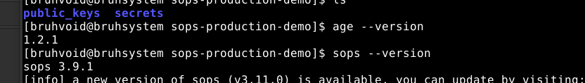
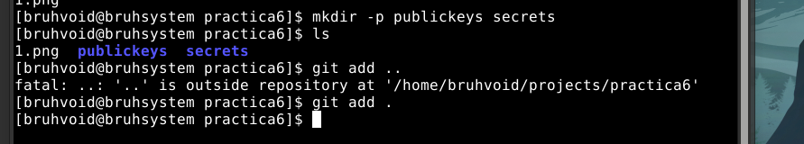
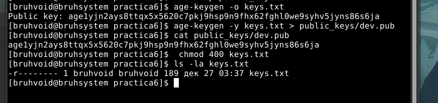
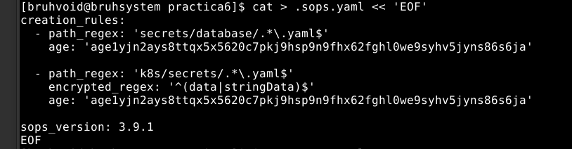
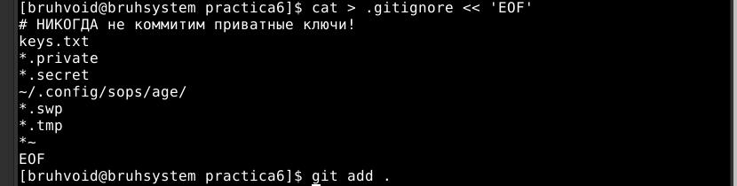
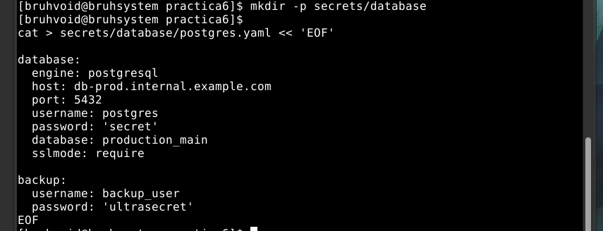
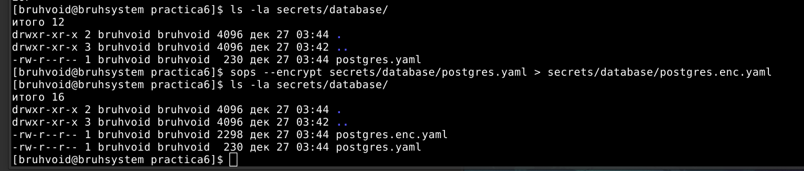
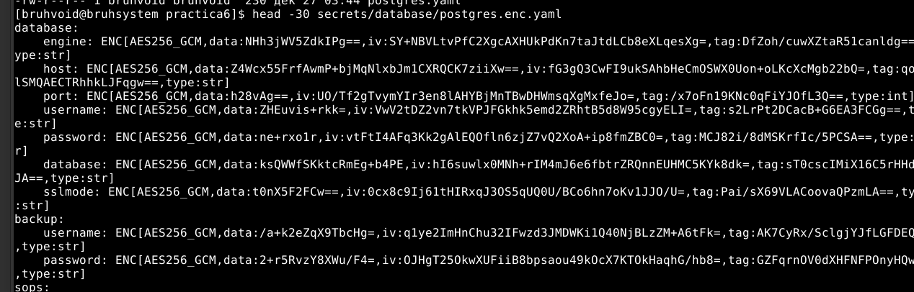
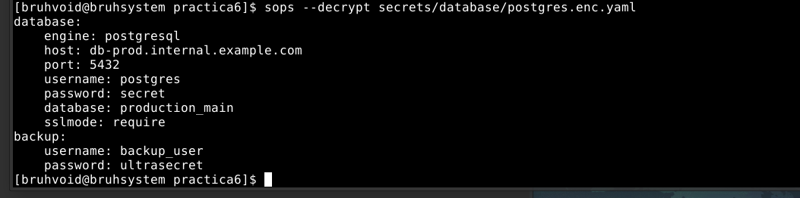
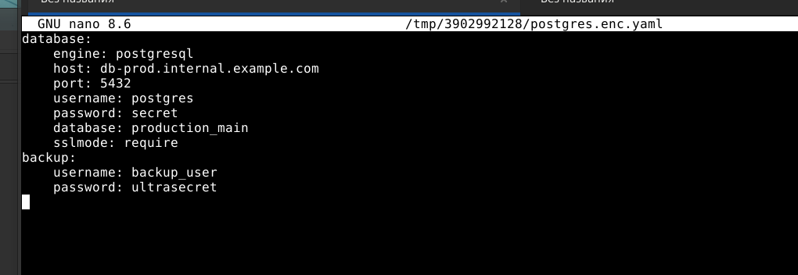

# Практика 6 — SOPS + age на Void Linux

В этой работе в репозитории `practica6` была настроена связка **age** и **SOPS** для безопасного хранения секретов в Git на системе Void Linux.

---

## 1. Подготовка окружения

Вначале были установлены утилиты age и SOPS через менеджер пакетов Void Linux `xbps`.

```bash
sudo xbps-install -Su
sudo xbps-install age sops

age --version
sops --version
```

Ниже показана проверка версий age и SOPS после установки:



---

## 2. Структура репозитория practica6

Все действия выполнялись внутри уже клонированного Git‑репозитория `practica6`.

```bash
cd ~/projects/practica6
mkdir -p publickeys secrets/database
```

Пример структуры каталога после подготовки папок:



---

## 3. Генерация ключей age

Далее была создана пара ключей age, приватный ключ сохраняется в `keys.txt`, а публичный — в `publickeys/dev.pub`.

```bash
age-keygen -o keys.txt
age-keygen -y keys.txt > publickeys/dev.pub
chmod 400 keys.txt

cat publickeys/dev.pub
ls -la keys.txt
```

На скриншоте видно сгенерированный публичный ключ и права доступа на `keys.txt`:


---

## 4. Настройка .sops.yaml

В корне репозитория был создан файл `.sops.yaml`, который описывает правила шифрования для YAML‑файлов с секретами.

```yaml
creation_rules:
  - path_regex: 'secrets/database/.*\.yaml$'
    age: 'agelyjn2ays8ttqx5x5620c7pkj9hsp9n9fhx62fghl0we9syhv5jyns86s6ja'

  - path_regex: 'k8s/secrets/.*\.yaml$'
    encrypted_regex: '^(data|stringData)$'
    age: 'agelyjn2ays8ttqx5x5620c7pkj9hsp9n9fhx62fghl0we9syhv5jyns86s6ja'

sops_version: 3.9.1
```

Создание `.sops.yaml` через here‑document в Shell и его содержимое:



---

## 5. Настройка .gitignore

Чтобы приватные ключи и временные файлы не попадали в Git, был создан файл `.gitignore` в корне репозитория.

```bash
cat > .gitignore << 'EOF'
# НИКОГДА не коммитим приватные ключи!
keys.txt
*.private
*.secret
~/.config/sops/age/
*.swp
*.tmp
*~
EOF
```

Пример команды `git add` после настройки игнорируемых файлов:



---

## 6. Создание открытого секрета postgres.yaml

Для демонстрации работы SOPS был подготовлен YAML‑файл с данными для подключения к PostgreSQL.

```bash
mkdir -p secrets/database

cat > secrets/database/postgres.yaml << 'EOF'
database:
  engine: postgresql
  host: db-prod.internal.example.com
  port: 5432
  username: postgres
  password: 'secret'
  database: production_main
  sslmode: require

backup:
  username: backup_user
  password: 'ultrasecret'
EOF
```

Ниже показано содержимое незашифрованного файла `postgres.yaml` в редакторе:



---

## 7. Шифрование секрета с помощью SOPS

Затем файл `postgres.yaml` был зашифрован в `postgres.enc.yaml` по правилам из `.sops.yaml`.

```bash
sops --encrypt secrets/database/postgres.yaml > secrets/database/postgres.enc.yaml

ls -la secrets/database/
head -30 secrets/database/postgres.enc.yaml
```

На следующем скриншоте видно, что все чувствительные поля заменены на блоки `ENC[AES256_GCM,...]`:



---

## 8. Настройка ключа для SOPS

Чтобы SOPS мог автоматически находить приватный ключ, он был добавлен в конфигурацию.

```bash
mkdir -p ~/.config/sops/age
cp keys.txt ~/.config/sops/age/keys.txt
chmod 400 ~/.config/sops/age/keys.txt
```

Содержимое каталога с ключом:



---

## 9. Расшифровка файла postgres.enc.yaml

После настройки ключей была проверена корректность расшифровки файла `postgres.enc.yaml`.

```bash
sops --decrypt secrets/database/postgres.enc.yaml
```

На скриншоте видно, что SOPS восстанавливает исходный YAML с паролями `secret` и `ultrasecret`:



---

## 10. Просмотр исходного и шифрованного файлов

Для наглядности файл `postgres.enc.yaml` был открыт в редакторе, чтобы сравнить его с исходным `postgres.yaml`.



---

## 11. Итоговое состояние репозитория

В конце работы были добавлены все необходимые файлы в Git‑индекс, кроме приватных ключей, которые игнорируются `.gitignore`.

```bash
git status
git add .
git commit -m "Configure SOPS + age and encrypt postgres secret"
```

Общий вид репозитория и подтверждение успешного шифрования показаны на итоговом скриншоте:



---